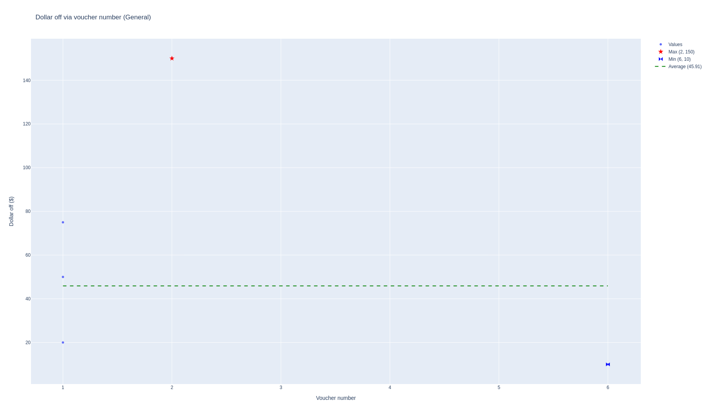
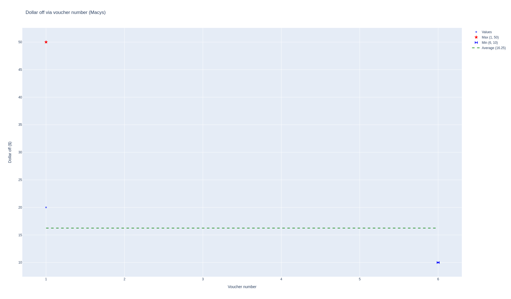
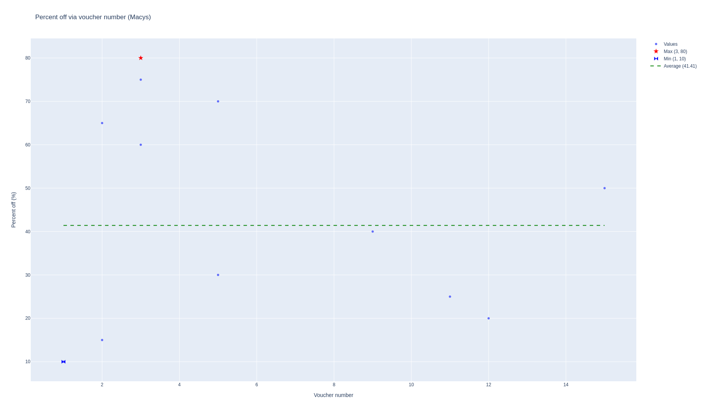
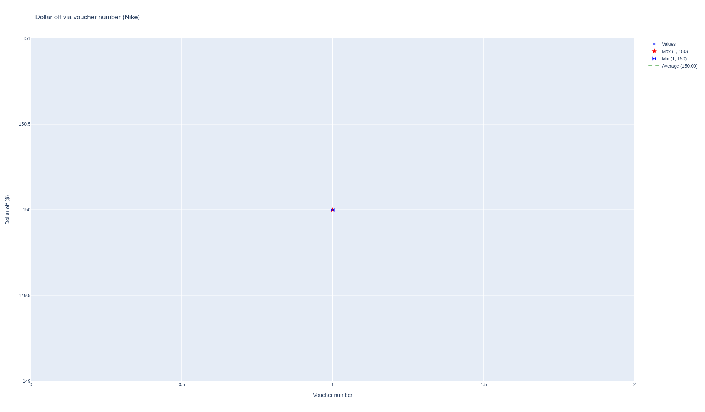
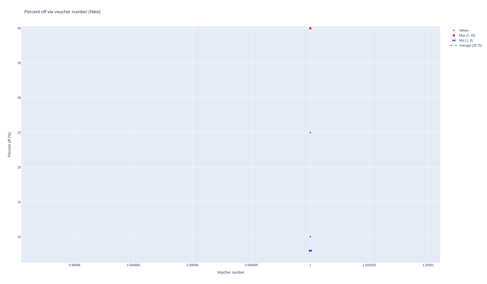
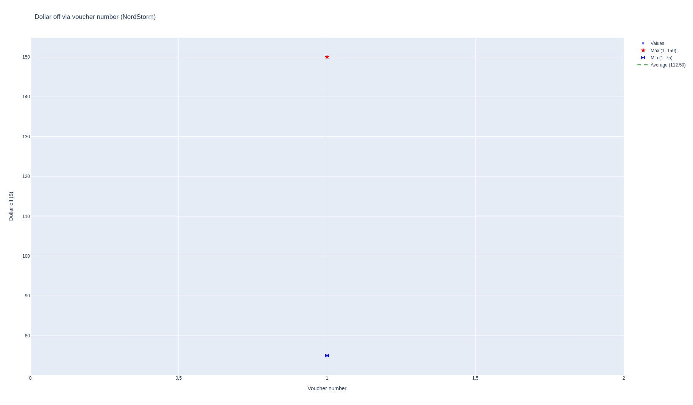
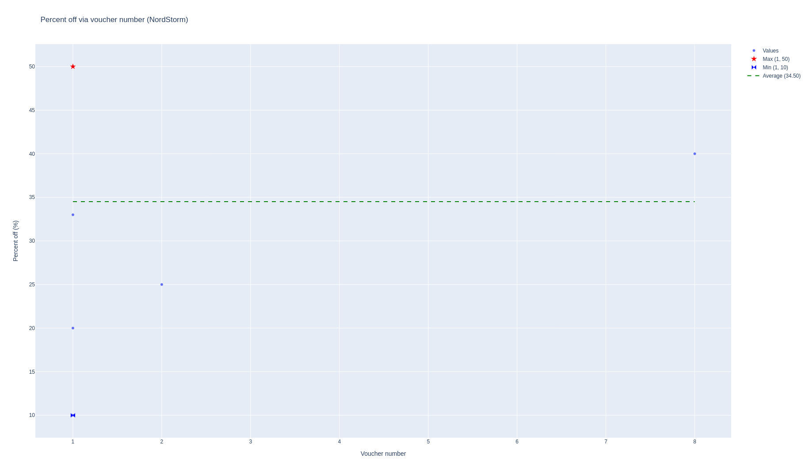

# PENG

## Requirements and installation

 - virtualenv named `peng` (used pyenv)
 - python 3.10.0
 - pyenv local peng
 - pip, pip-tools
 - pip-compile
 - pip-sync

## Explanation

I choose to use [plotly](https://plotly.com/) to show graph as the interface is nice and straightforward.
Can show complex graph with a minimum amount of code.
It's also customizable and a known/stared library with huge community and documentation.
In addition, it's possible to interact with the graph (zoom, download, autoscale, ...).

## Results

### General vouchers statistics



### Macys vouchers statistics



### Nike vouchers statistics



### NordStorm vouchers statistics



## Unit testing

Some basic testing have been implemented using `unittest`
```python
python -m unittest test_voucher_computer.py
```